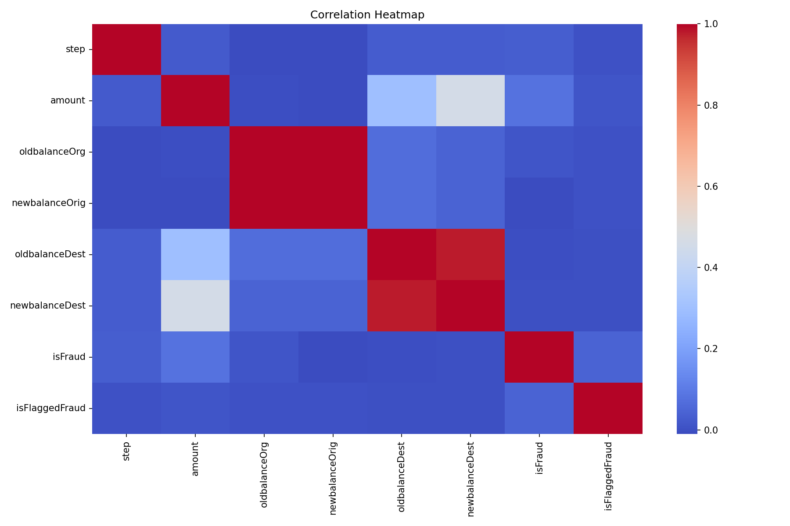
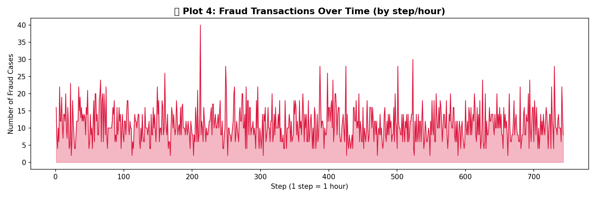
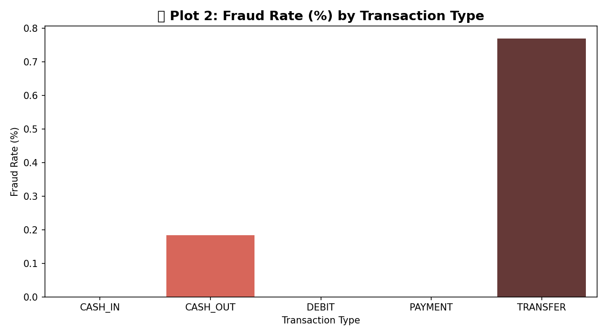
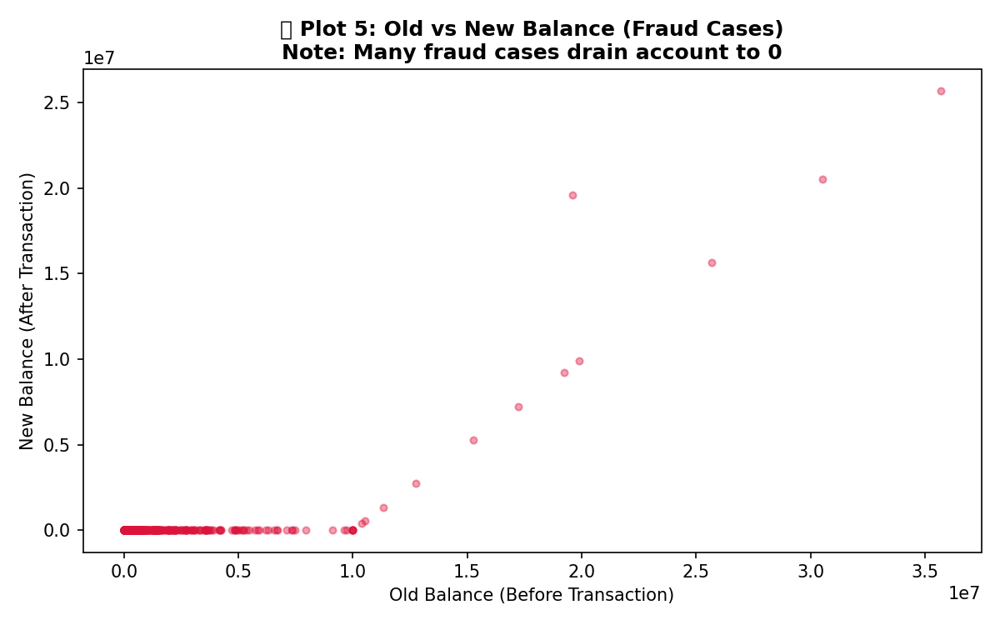

<div align="center">
  
  <h1>🕵️‍♂️ FraudEye</h1>
  <p><b>Advanced Real-time Fraud Detection System powered by Machine Learning</b></p>

  <p>
    
    
    
    
    
  </p>
</div>

---

## 📖 Overview

**FraudEye** is a comprehensive end-to-end fraud detection platform designed to identify suspicious financial transactions with high precision. By combining traditional rule-based logic with state-of-the-art machine learning models like CatBoost and XGBoost, FraudEye provides a robust defense against digital financial threats.

> "Empowering financial institutions with real-time insights and automated threat response."

---

## ✨ Key Features

| Feature | Description | Status |
| :--- | :--- | :---: |
| 🚀 **Real-time API** | FastAPI-powered endpoint for sub-millisecond predictions. | ✅ |
| 📊 **Interactive Dashboard** | Visual analytics for transaction trends and fraud patterns. | ✅ |
| 🧠 **Advanced ML** | Gradient Boosted models (CatBoost) for high-accuracy detection. | ✅ |
| 🔍 **Explainable AI** | SHAP integration to understand *why* a transaction was flagged. | ✅ |
| 🛡️ **Rule Engine** | Hybrid approach combining ML with heuristic fraud rules. | ✅ |
| 🧪 **Simulation Client** | Stress-test the system with simulated transaction bursts. | ✅ |

---

## 🖼️ Visual Insights

<div align="center">
  <table style="width:100%">
    <tr>
      <td align="center"><b>Transaction Correlation</b><br/></td>
      <td align="center"><b>Fraud Over Time</b><br/></td>
    </tr>
    <tr>
      <td align="center"><b>Fraud Rate by Type</b><br/></td>
      <td align="center"><b>Balance Distribution</b><br/></td>
    </tr>
  </table>
</div>

---

## 🛠️ Tech Stack

| Layer | Technology |
| :--- | :--- |
| **Language** | Python 3.12 |
| **Backend** | FastAPI, Uvicorn |
| **Machine Learning** | CatBoost, Scikit-learn, XGBoost |
| **Data Processing** | Pandas, NumPy |
| **Visualization** | Seaborn, Matplotlib, Chart.js |
| **DevOps** | Docker, GitHub Actions |

---

## 🚀 Getting Started

### 📋 Prerequisites
- Python 3.9 or higher
- [Kaggle Dataset](https://www.kaggle.com/datasets/ealaxi/paysim1) (Download `PS_20174392719_1491204439457_log.csv`)

### 🛠️ Local Setup
1. **Clone the repository:**
   ```bash
   git clone https://github.com/sneehaaroraa/fraud-detection-project.git
   cd fraud-detection-project
   ```

2. **Install dependencies:**
   ```bash
   pip install -r requirements.txt
   ```

3. **Run the API Service:**
   ```bash
   uvicorn src.api_service:app --reload
   ```

4. **Run a Simulation:**
   ```bash
   python src/simulation_client.py
   ```

---

## 📁 Project Structure

```bash
.
├── dashboard/          # Interactive web dashboard
├── docs/               # Documentation & project assets
│   ├── assets/         # README images & plots
│   └── reports/        # Weekly progress & analysis reports
├── models/             # Serialized ML models (.pkl)
├── src/                # Core source code
│   ├── 01_exploration.py
│   ├── 02_preparation.py
│   ├── api_service.py  # FastAPI Backend
│   └── simulation_client.py
└── Dockerfile          # Containerization config
```

---

## 🗺️ Roadmap

- [x] Initial EDA & Data Cleaning
- [x] Baseline Random Forest Model
- [x] Advanced CatBoost Model with SHAP
- [x] FastAPI Service Implementation
- [ ] Real-time Database Integration (PostgreSQL)
- [ ] Kubernetes Deployment Helm Charts
- [ ] Multi-tenant Authentication

---

## 👤 Author
**Sneha Arora**  
*Student Project — Threat Response in Digital Transactions*  

---

<div align="center">
  <sub>Built with ❤️ for a safer digital economy.</sub>
</div>
