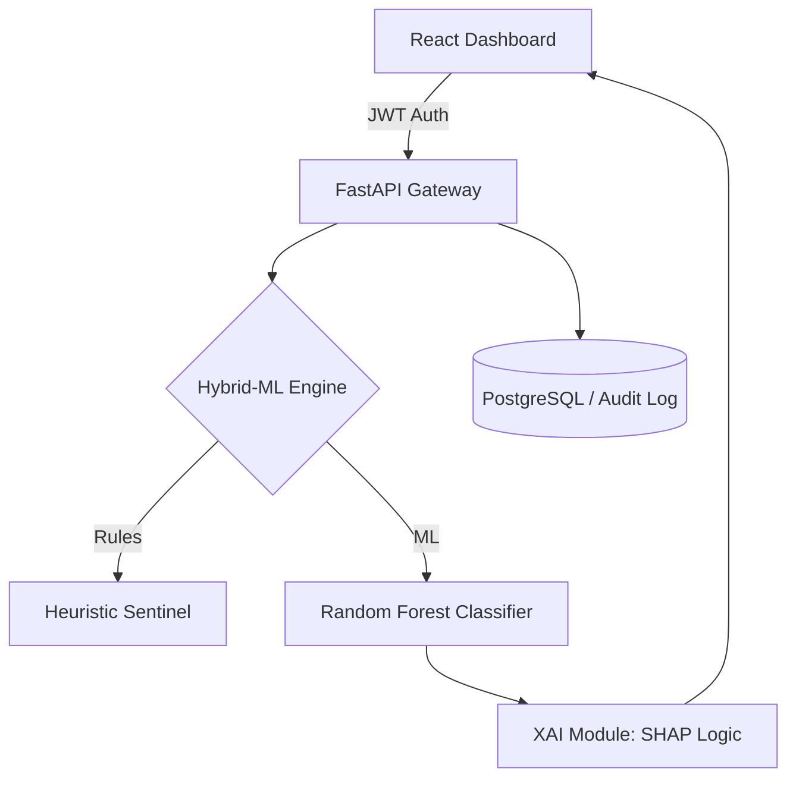

# 🕵️‍♂️ FraudEye Pro: Enterprise-Grade Fraud Intelligence Platform
> **A High-Performance Cybersecurity SaaS for Real-time Financial Threat Detection.**

[](https://fastapi.tiangolo.com/)
[](https://reactjs.org/)
[](https://scikit-learn.org/)
[](./compliance/COMPLIANCE.md)

---

## 📖 Overview
**FraudEye Pro** is a production-ready Cybersecurity platform designed for modern financial institutions. It bridges the gap between **Data Science** and **Operational Security** by integrating a Hybrid-ML detection engine into a professional SOC (Security Operations Center) dashboard.

### 🌟 Key Value Propositions
*   **Explainable AI (XAI)**: No more "Black Box" predictions. Analysts see the exact logic behind every risk score.
*   **Midnight SOC Interface**: High-contrast dark-mode dashboard designed for 24/7 monitoring.
*   **Incident Response (IR)**: Built-in rapid containment actions to freeze accounts and block malicious flows instantly.
*   **Compliance-First**: Every transaction is audit-logged and mapped to **PCI-DSS 4.0** and **RBI** standards.

---

## 🏗️ System Architecture
The platform follows a scalable **SaaS Architecture**:



---

## ✨ Advanced Features

### 🧠 Explainable AI (XAI) Sentinel
Instead of just returning a "Fraud" flag, FraudEye Pro breaks down the **Rationale**:
- `Account Liquidation (Drained)`
- `Extreme Transaction Amount`
- `High-Risk Origin (TRANSFER)`

### 🚨 Insider Threat Analytics
Dedicated heuristics to detect anomalous bursts in administrative activity and high-frequency transaction patterns that bypass traditional filters.

### 🔒 Enterprise Security
- **JWT-based Sessions**: Secure stateless authentication.
- **Rate Limiting**: Brute-force protection on all sensitive endpoints.
- **Audit Trails**: Forensic-ready logging of all analyst actions and system predictions.

---

## 🛠️ Tech Stack
| Category | Technologies |
| :--- | :--- |
| **Backend** | Python, FastAPI, SQLAlchemy, JWT, SlowAPI |
| **Frontend** | React, Tailwind CSS, Axios, Recharts |
| **Intelligence** | Scikit-Learn, NumPy, XAI Heuristics |
| **DevOps** | Docker, Docker-Compose, Vercel |
| **Database** | PostgreSQL (Production), SQLite (Dev) |

---

## 🚀 Getting Started

### 📦 Quick Start with Docker
```bash
docker-compose up --build
```

### 🛠️ Manual Installation
**Backend:**
```bash
cd api
pip install -r ../requirements.txt
python index.py
```
**Frontend:**
```bash
cd frontend
npm install
npm start
```

---

## 👤 Author
**Sneha Arora**  
*Full-Stack Cybersecurity Engineer | Fraud Intelligence Specialist*  
[LinkedIn Profile](https://www.linkedin.com/in/sneehaaroraa/) • [Portfolio Site](https://sneehaaroraa.com)

---
<div align="center">
  <sub>Built with ❤️ for a safer financial future.</sub>
</div>
